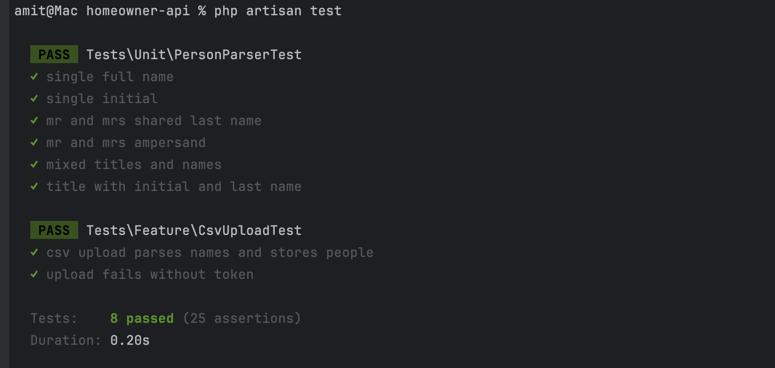
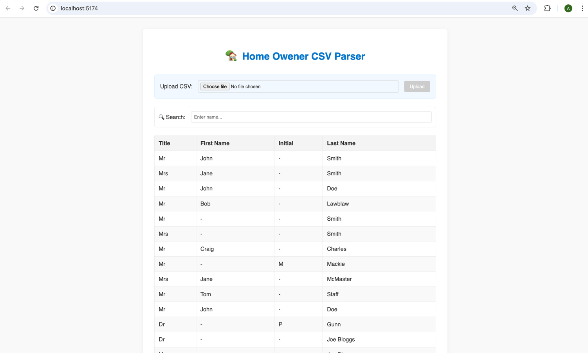

# Homeowner Platform

**A modular full-stack application for managing homeowner data, built with:**

#### Backend: Laravel API (homeowner-api)
#### Frontend: Vue (homeowner-ui)


## Configuration

- PHP ^8.2
- Composer
- MySQL or compatible DB
- Laravel 12
- Node.js + Vue

---

##  Backend Setup (homeowner-api)

### 1. Clone the repository

```bash
https://github.com/amit9288-panchal/home-owner.git
cd homeowner-api
```

### 2. Install PHP and Node.js dependencies
```bash
composer install
npm install
```
### 3. Set up environment variables
Copy the example environment file:
```bash
cp .env.example .env
```

Generate Laravel application key:
```bash
php artisan key:generate
```

### 4. Set up your database and configure in .env than execute migration

```bash
php artisan migrate
```
### 5. Start the server

```bash
php artisan serve --port=8000
```

#### 2. Backend  API

```bash
curl --location 'http://127.0.0.1:8000/api/v1/upload' \
  --header 'X-Auth-Token: **********' \
  --form 'csv=@"/Users/amit/Downloads/examples-4-.csv"'
```
```bash
curl --location 'http://127.0.0.1:8000/api/v1/people' \
--header 'X-Auth-Token: ***********'
```

## Backend Testing

Note: Create a testing database and configure test environment
```bash
cp .env.example .env.testing

php artisan migrate --env=testing
```
```bash
php artisan test
```



---

## Frontend Setup (homeowner-ui)

### 1. Go to a frontend project

```bash
cd homeowner-ui
```
### 1. Install dependencies

```bash
npm install
```
### 2. Configure environment
```bash
cp .env.example .env
```

### 3. Run the frontend
```bash
npm run dev
```

